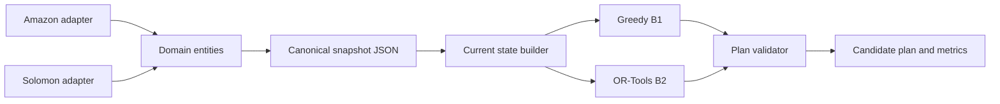

# W2 — Data foundation + baseline
# W2 — Data foundation + baseline

**v3 update:** baseline and validator now score closed routes, including the
return leg to the depot. The planner and validator only consider orders released
at the snapshot time (`--at-time`, default 0). Amazon package time windows at a
shared stop are combined by intersection. Checked-in reports were regenerated;
the test suite now has 21 tests.

**v2 update:** schema/instance_schema.json đã sửa lại cho khớp đúng Domain Model
(Thiết kế hệ thống, Mục 4.1) — thêm `scenario_id`, `order.release_time`,
`order.status`, `vehicle.status`, `vehicle.remaining_capacity`; đổi tên
`due_time`→`deadline`, `start_location`→`current_stop`. `validator.py` giờ
check capacity theo `remaining_capacity` (Q_k còn lại) thay vì `capacity` gốc,
và chặn order gán cho vehicle `UNAVAILABLE`. Tất cả 18 unit test (14 cũ + 4 mới
cho field vừa thêm) pass; baseline chạy lại cho metrics giống hệt bản trước
(đổi field, không đổi logic).

Deliverable theo kế hoạch: **Normalize Amazon; instance schema; Solomon subset;
baseline no-replan + Greedy Insertion; feasibility validator → "Data + baseline
chạy"**.

## Cấu trúc

```
schema/instance_schema.json     # canonical instance schema (JSON Schema draft-07)
data/solomon/                   # Solomon-format sample (synthetic, xem giới hạn bên dưới)
data/amazon_sample/             # Amazon Last-Mile-format sample (synthetic, xem giới hạn bên dưới)
data/normalized/                # output đã normalize về canonical schema
src/parse_solomon.py            # Solomon .txt -> canonical schema
src/normalize_amazon.py         # route_data/package_data/travel_times.json -> canonical schema
src/validator.py                # feasibility validator (instance + plan)
src/greedy_insertion.py         # baseline B1 — Cheapest Insertion
src/run_baseline.py             # orchestrator: load -> validate -> Greedy -> validate plan -> report
tests/test_pipeline.py          # 14 unit test, có đáp án biết trước tay
output/                         # report + plan sinh ra khi chạy run_baseline.py
```

## Chạy thử

```bash
cd src
python3 run_baseline.py ../data/normalized/solomon_sample_15.json --out ../output
python3 run_baseline.py ../data/normalized/amazon_sample_route01.json --out ../output
python3 -m pytest ../tests/ -v      # hoặc: python3 ../tests/test_pipeline.py
```

Kết quả đã chạy thử (xem `output/*.report.json`): cả 2 nguồn dữ liệu ra plan
**feasible = True**, không vi phạm hard constraint; 21 unit test pass.

## GIỚI HẠN QUAN TRỌNG — đọc trước khi dùng cho W3 trở đi

1. **Dữ liệu Amazon thật đã có trong `real_data/`.** Bộ training nằm tại
   `real_data/almrrc2021-data-training/model_build_inputs/` với ba file
   `route_data.json`, `package_data.json`, `travel_times.json`. Dùng route ID
   thật để kiểm tra normalizer, ví dụ:
   ```bash
   python src/normalize_amazon.py ./real_data/almrrc2021-data-training/model_build_inputs RouteID_00143bdd-0a6b-49ec-bb35-36593d303e77
   ```
   Lưu ý `travel_times.json` khoảng 1.8 GB; script hiện đọc cả ba JSON vào bộ
   nhớ, nên cần RAM lớn. `data/amazon_sample/` vẫn là sample synthetic để chạy
   smoke test nhanh.

2. **Solomon cũng là file synthetic đúng ĐỊNH DẠNG**, không phải bộ instance
   C101/R101 gốc (tránh rủi ro chép sai số liệu benchmark chính thức từ trí
   nhớ). Muốn benchmark thật: tải từ
   http://web.cba.neu.edu/~msolomon/problems.htm hoặc VRP-REP, bỏ file `.txt`
   cùng định dạng vào `data/solomon/` — `parse_solomon.py` không cần sửa.

3. **1 route Amazon = 1 vehicle** hiện tại (đúng cấu trúc dataset gốc: mỗi
   route là 1 xe đã chạy). Muốn có fleet nhiều xe thật cho dynamic scenario
   (cần cho W4 trở đi — New Order/Breakdown chỉ có ý nghĩa khi có ≥2 xe), cần
   gộp nhiều `route_id` cùng station — **chưa làm ở W2**, cố ý để ngoài scope,
   cần bổ sung trước khi dùng cho mô phỏng dynamic.

4. Demand của order Amazon dùng **thể tích (cm³)** vì `executor_capacity_cm3`
   là đơn vị capacity gốc của dataset — khác Solomon dùng demand đơn vị trừu
   tượng. Khi trộn 2 nguồn dữ liệu trong cùng 1 benchmark (W10), cần chuẩn hóa
   lại đơn vị capacity cho nhất quán.

5. `greedy_insertion.py` hiện tính lại `simulate_route` cho từng vị trí chèn
   (đúng đắn nhưng chưa tối ưu tốc độ) — đủ nhanh cho instance nhỏ ở W2
   (< 0.01s), cần benchmark lại độ phức tạp khi test ở scale 100K/1M (W10).

## Việc tiếp theo (W3)

Theo Problem Specification v1: W3 = "Static optimizer + validator + current-
state builder" — dùng `validator.py` này làm nền, thêm OR-Tools (P-CI + GLS)
làm baseline B2 để so sánh với Greedy Insertion (B1) đã có ở đây.

## W3 — Static optimizer + validator + current-state builder

Deliverable: OR-Tools (B2, Parallel Cheapest Insertion + Guided Local Search)
chạy song song với Greedy Insertion (B1), cùng validate bằng `validator.py`.

## Kiến trúc code

Code dùng cấu trúc theo tầng. Dữ liệu nguồn đi qua adapter tương ứng, được
chuẩn hóa thành các entity nghiệp vụ, rồi serialize thành một canonical
snapshot JSON. Từ snapshot đó, current-state builder lọc phần việc còn lại;
optimizer tạo candidate plan; validator đánh giá candidate trước khi trả kết
quả cho CLI. Solver không sở hữu hay sửa operational state.



`src/domain/entities.py` định nghĩa `Scenario`, `Location`, `Depot`, `Order`,
`Vehicle`, `TimeMatrix`, `RoutingSnapshot`, `Event`, `DeliveryPlan`, `Route` và
`RouteStop`. Một `DeliveryPlan` có nhiều `Route`; mỗi `Route` gắn với đúng một
`vehicle_id` và chứa các `RouteStop` theo `sequence`. Hai adapter
Amazon và Solomon tạo `RoutingSnapshot`; `src/domain/codec.py` là nơi đọc/ghi
snapshot JSON. Snapshot vẫn là một file để dễ chạy benchmark, nhưng các nhóm
entity trong file tách riêng theo schema. `matrix_version` nằm cùng snapshot
và được copy vào candidate dưới tên `base_matrix_version`.

Các module B1/B2 hiện vẫn giữ dict canonical ở ranh giới tương thích. B2 có
trách nhiệm chuyển node ID thành index nội bộ OR-Tools; index đó không thoát ra
khỏi optimizer. Event ingestion, State Manager, Planning Orchestrator và Commit
Gate là các thành phần thuộc các tuần dynamic tiếp theo, chưa được giả vờ là đã
triển khai trong W2/W3.

W3 files and extensions:
- `src/current_state.py` — current-state builder: lọc order ACTIVE theo
  `release_time`/`status`, loại vehicle `UNAVAILABLE`, chuẩn bị node list cho
  solver. Tách riêng khỏi OR-Tools để dễ đổi solver sau này (ALNS ở đồ án tốt
  nghiệp) mà không viết lại phần lọc state.
- `src/or_tools_optimizer.py` — B2: OR-Tools `PARALLEL_CHEAPEST_INSERTION` +
  `GUIDED_LOCAL_SEARCH`. ready_time = hard lower-bound (`CumulVar.SetMin`),
  deadline = soft upper-bound penalty (`SetCumulVarSoftUpperBound`, hệ số =
  beta), unserved = `AddDisjunction` với penalty = alpha. Output CÙNG FORMAT
  với `greedy_insertion()` nên đi thẳng qua `validate_plan()` không cần đổi gì.
- `src/compare_b1_b2.py` — chạy B1 + B2 trên cùng instance, in bảng so sánh.
- `tests/test_or_tools.py` — 18 test W3 (39 test tổng cùng `test_pipeline.py`).

### Snapshot time, version và virtual vehicle start

- `state_version` là metadata của snapshot, mặc định `0` cho instance tĩnh.
  `build_current_state()` trả nó cùng state; candidate B1/B2 mang
  `base_state_version` để lớp orchestration có thể kiểm tra stale plan.
- `matrix_version` định danh phiên bản `time_matrix`; tăng version mỗi khi ma
  trận thay đổi. Candidate B1/B2 ghi `base_matrix_version` để nhận biết plan
  được tạo từ ma trận cũ. `time_matrix[from][to]` lưu thời gian đi (giây),
  không lưu quãng đường.
- Mỗi xe khả dụng nhận một solver-only virtual start node riêng, không dùng
  trực tiếp ID của `current_stop`. Vì vậy xe có thể đang ở đúng vị trí của một
  customer mà customer đó vẫn còn là node cần được phục vụ.
- `current_stop` là node ID biểu diễn vị trí vật lý hiện tại. Nếu xe đang ở
  giữa đường, simulator/state producer phải tạo/cập nhật node vị trí đó và
  cập nhật `time_matrix` của snapshot với travel time từ vị trí hiện tại
  tới các customer/depot. Builder sao chép hàng/cột đó sang virtual start của
  xe; nó không tự suy ra đường đi từ tọa độ hay ma trận cũ.
- Time dimension cố định cumul ở start của mỗi xe bằng
  `max(planning_time, vehicle.start_time)` — tức τₖ — để không lập lịch xe từ
  trước thời điểm snapshot.

Kết quả chạy thật (`compare_b1_b2.py`) trên `solomon_sample_15.json`:

| | B1 Greedy | B2 OR-Tools |
|---|---|---|
| total_travel_time | 531.0 | **487.2** (-8.3%) |
| total_lateness (soft) | 82.1 | **0.0** |
| vehicles_used | 2 | 3 |
| runtime | 0.006s | 5.0s (time_limit) |

B2 không chỉ ngắn hơn mà còn **lateness=0** — Greedy nhồi 11 khách vào 1 xe
gây trễ, GLS trải đều ra 3 xe để tránh trễ. Đúng minh chứng giá trị của GLS so
với insertion thuần.

**GHI CHÚ QUAN TRỌNG — alpha/beta là PLACEHOLDER:** Problem Specification v1
Mục 4 chỉ chốt CƠ CHẾ (weighted-sum, alpha >> beta >> gamma=1), KHÔNG chốt
con số — sẽ benchmark ở W7. Đừng diễn giải các số trong bảng trên là kết quả
đã tuned.

**W3 B2 chưa được đối chiếu trên route Amazon thật.** Bạn đã chạy B1 trên một
route Amazon thật; để so sánh B1/B2, trước hết cần lưu instance canonical sau
normalization rồi chạy:
```bash
python src/compare_b1_b2.py <normalized-real-route.json>
```
Route có 118 stops khiến B1 mất khoảng 23 giây trong lần chạy đã ghi nhận;
hãy đặt `--time-limit` cho B2 và đo riêng runtime.

**v3 update:** baseline and validator now score closed routes, including the
return leg to the depot. The planner and validator only consider orders released
at the snapshot time (`--at-time`, default 0). Amazon package time windows at a
shared stop are combined by intersection. Checked-in reports were regenerated;
the test suite now has 21 tests.

**v2 update:** schema/instance_schema.json đã sửa lại cho khớp đúng Domain Model
(Thiết kế hệ thống, Mục 4.1) — thêm `scenario_id`, `order.release_time`,
`order.status`, `vehicle.status`, `vehicle.remaining_capacity`; đổi tên
`due_time`→`deadline`, `start_location`→`current_stop`. `validator.py` giờ
check capacity theo `remaining_capacity` (Q_k còn lại) thay vì `capacity` gốc,
và chặn order gán cho vehicle `UNAVAILABLE`. Tất cả 18 unit test (14 cũ + 4 mới
cho field vừa thêm) pass; baseline chạy lại cho metrics giống hệt bản trước
(đổi field, không đổi logic).

Deliverable theo kế hoạch: **Normalize Amazon; instance schema; Solomon subset;
baseline no-replan + Greedy Insertion; feasibility validator → "Data + baseline
chạy"**.

## Cấu trúc

```
schema/instance_schema.json     # canonical instance schema (JSON Schema draft-07)
src/domain/                     # entity nghiệp vụ + codec đọc/ghi snapshot JSON
data/solomon/                   # Solomon-format sample (synthetic, xem giới hạn bên dưới)
data/amazon_sample/             # Amazon Last-Mile-format sample (synthetic, xem giới hạn bên dưới)
data/normalized/                # output đã normalize về canonical schema
src/parse_solomon.py            # Solomon .txt -> canonical schema
src/normalize_amazon.py         # route_data/package_data/travel_times.json -> canonical schema
src/validator.py                # feasibility validator (instance + plan)
src/greedy_insertion.py         # baseline B1 — Cheapest Insertion
src/run_baseline.py             # orchestrator: load -> validate -> Greedy -> validate plan -> report
tests/test_pipeline.py          # 14 unit test, có đáp án biết trước tay
output/                         # report + plan sinh ra khi chạy run_baseline.py
```

## Chạy thử

```bash
cd src
python3 run_baseline.py ../data/normalized/solomon_sample_15.json --out ../output
python3 run_baseline.py ../data/normalized/amazon_sample_route01.json --out ../output
python3 -m pytest ../tests/ -v      # hoặc: python3 ../tests/test_pipeline.py
```

Kết quả đã chạy thử (xem `output/*.report.json`): cả 2 nguồn dữ liệu ra plan
**feasible = True**, không vi phạm hard constraint; 21 unit test pass.

## GIỚI HẠN QUAN TRỌNG — đọc trước khi dùng cho W3 trở đi

1. **Dữ liệu Amazon thật đã có trong `real_data/`.** Bộ training nằm tại
   `real_data/almrrc2021-data-training/model_build_inputs/` với ba file
   `route_data.json`, `package_data.json`, `travel_times.json`. Dùng route ID
   thật để kiểm tra normalizer, ví dụ:
   ```bash
   python src/normalize_amazon.py ./real_data/almrrc2021-data-training/model_build_inputs RouteID_00143bdd-0a6b-49ec-bb35-36593d303e77
   ```
   Lưu ý `travel_times.json` khoảng 1.8 GB; script hiện đọc cả ba JSON vào bộ
   nhớ, nên cần RAM lớn. `data/amazon_sample/` vẫn là sample synthetic để chạy
   smoke test nhanh.

2. **Solomon cũng là file synthetic đúng ĐỊNH DẠNG**, không phải bộ instance
   C101/R101 gốc (tránh rủi ro chép sai số liệu benchmark chính thức từ trí
   nhớ). Muốn benchmark thật: tải từ
   http://web.cba.neu.edu/~msolomon/problems.htm hoặc VRP-REP, bỏ file `.txt`
   cùng định dạng vào `data/solomon/` — `parse_solomon.py` không cần sửa.

3. **1 route Amazon = 1 vehicle** hiện tại (đúng cấu trúc dataset gốc: mỗi
   route là 1 xe đã chạy). Muốn có fleet nhiều xe thật cho dynamic scenario
   (cần cho W4 trở đi — New Order/Breakdown chỉ có ý nghĩa khi có ≥2 xe), cần
   gộp nhiều `route_id` cùng station — **chưa làm ở W2**, cố ý để ngoài scope,
   cần bổ sung trước khi dùng cho mô phỏng dynamic.

4. Demand của order Amazon dùng **thể tích (cm³)** vì `executor_capacity_cm3`
   là đơn vị capacity gốc của dataset — khác Solomon dùng demand đơn vị trừu
   tượng. Khi trộn 2 nguồn dữ liệu trong cùng 1 benchmark (W10), cần chuẩn hóa
   lại đơn vị capacity cho nhất quán.

5. `greedy_insertion.py` hiện tính lại `simulate_route` cho từng vị trí chèn
   (đúng đắn nhưng chưa tối ưu tốc độ) — đủ nhanh cho instance nhỏ ở W2
   (< 0.01s), cần benchmark lại độ phức tạp khi test ở scale 100K/1M (W10).

## Việc tiếp theo (W3)

Theo Problem Specification v1: W3 = "Static optimizer + validator + current-
state builder" — dùng `validator.py` này làm nền, thêm OR-Tools (P-CI + GLS)
làm baseline B2 để so sánh với Greedy Insertion (B1) đã có ở đây.
